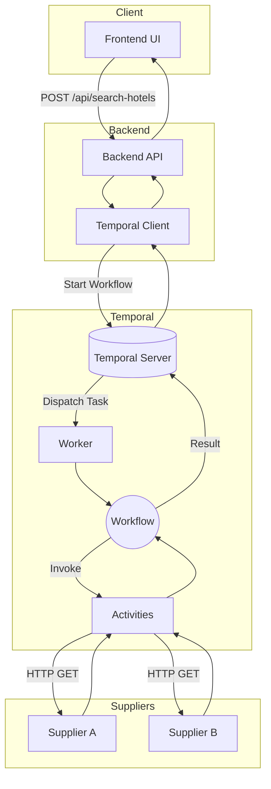

# Hotel Rate Comparator

## What this project does

This project is a full-stack hotel rate aggregation tool. It takes a user's search criteria (city, check-in, check-out) and concurrently fetches hotel prices from two external mock suppliers. The system then compares the rates, identifies the cheapest option, and returns the result to the user. It is built to gracefully handle the messy reality of 3rd-party integrations, such as timeouts, partial failures, empty responses, and user cancellations.

## Why Temporal?

When aggregating data from multiple third-party suppliers, we inevitably encounter:

- unreliable suppliers returning 500s
- slow suppliers hanging requests
- partial failure (one supplier succeeds, the other fails)
- the need for parallel execution, retries, and timeouts
- users cancelling searches mid-flight

While it is possible to manually coordinate these concerns using standard Node.js `Promise.allSettled`, `setTimeout`, and custom retry loops, that approach quickly becomes complex, hard to test, and vulnerable to edge cases (e.g., losing track of promises on server restart, leaking memory on cancellations).

Temporal provides durable workflow execution. It handles retries, timeouts, and cancellations out of the box as first-class primitives. By moving the orchestration logic into a Temporal Workflow, the backend API becomes a stateless thin client. If the worker crashes mid-search, Temporal simply resumes the workflow on another worker exactly where it left off.

## Architecture



## Workflow behavior

When a search request is received, the `hotelSearchWorkflow` executes the following steps:

1. **Fan out:** The workflow executes two activities concurrently to fetch prices from Supplier A and Supplier B.
2. **Wait and settle:** It waits for both activities to complete using `Promise.allSettled`, ensuring one supplier's failure does not abort the other's in-flight request.
3. **Cancellation check:** If the workflow was cancelled and both activities were aborted, it throws a cancellation error to exit cleanly.
4. **Result mapping:** It normalizes the results from both suppliers (handling timeouts and errors as valid states).
5. **Total failure check:** If both suppliers completely failed to return data, the workflow throws a domain-specific `ALL_SUPPLIERS_FAILED` error.
6. **Comparison:** It compares the prices from the successful suppliers, picks the cheapest hotel, and returns the final aggregate result.

## Failure handling

| Scenario                        | Behavior                                                                               |
| :------------------------------ | :------------------------------------------------------------------------------------- |
| **A is cheaper than B**         | Returns Supplier A.                                                                    |
| **B is cheaper than A**         | Returns Supplier B.                                                                    |
| **Equal price (A == B)**        | Deterministically returns Supplier A by default.                                       |
| **A fails, B succeeds**         | Returns Supplier B, marks A as `error`.                                                |
| **A succeeds, B fails**         | Returns Supplier A, marks B as `error`.                                                |
| **Both suppliers fail**         | Fails the search entirely (HTTP 502 Bad Gateway) with an `ALL_SUPPLIERS_FAILED` error. |
| **A returns empty, B succeeds** | Returns Supplier B, marks A as `empty`.                                                |
| **A succeeds, B returns empty** | Returns Supplier A, marks B as `empty`.                                                |
| **Both return empty**           | Returns 200 OK but with `cheapest: null` and `status: no_results`.                     |

## Retry policy

Activities interacting with suppliers use Temporal's built-in retry policies:

- **Which supplier retries:** Both Supplier A and Supplier B activities are wrapped in the same retry policy.
- **How many attempts:** Up to 3 maximum attempts.
- **Backoff:** Initial interval of 500ms with a backoff coefficient of 2 (max interval 2s).
- **Why:** Third-party APIs frequently experience transient failures (e.g., network blips, temporary 502/503 errors). A short exponential backoff allows us to recover from these hiccups without failing the user's search or waiting unnecessarily long.

## Timeout and latency budget

Each supplier gets a **5-second budget**, enforced inside the activity by an
`AbortController` on the `fetch`. Two Temporal timeouts sit above it as safety
nets: `startToCloseTimeout: 6s` per attempt and `scheduleToCloseTimeout: 8s`
across _all_ attempts.

The ordering matters. Because our own 5s deadline fires first, a slow supplier
fails with an attributable `SUPPLIER_TIMEOUT` we raised ourselves, rather than
an opaque Temporal `TimeoutFailure`. The workflow marks that supplier
`timeout` (distinct from `error`, and rendered differently in the UI) and
proceeds with the other supplier's rate.

Critically, `SUPPLIER_TIMEOUT` is declared **non-retryable**. A supplier that
blew a 5s budget will blow it again; retrying only makes the user wait. An
earlier revision let the timeout retry, which turned a 5s scenario into a
**15.7s** one — three sequential 5s attempts. The integration test now asserts
both the `timeout` status and a wall-clock bound so that regression cannot
return silently.

## Cancellation

When a user clicks "Cancel" on the frontend, the backend receives a `POST /api/search-hotels/:searchId/cancel` request.
The backend uses the Temporal Client to send a cancellation signal to the running workflow.
Temporal intercepts this signal and cancels the workflow context. This immediately cascades to the running HTTP activities, aborting the in-flight `fetch` requests via an `AbortController`. The workflow then completes as `CANCELLED`, freeing up resources without waiting for the slow suppliers to finish.

## Demo mode

To test edge cases without relying on flakey live endpoints, the backend provides a "Demo mode" via mock suppliers.
You can force specific behaviors by passing a `scenarios` object in the API request:

```json
{
  "scenarios": {
    "supplierA": "normal",
    "supplierB": "slow"
  }
}
```

Available scenarios are:

- `normal`: Responds in 300ms with a 200 OK.
- `slow`: Delays the response by 6000ms (exceeding the 5s timeout).
- `empty`: Responds with a 200 OK but an empty array of hotels.
- `error`: Responds instantly with a 500 Internal Server Error.
- `retry`: Fails the first two attempts with 500s, then succeeds on the 3rd attempt.

## Running locally

The repository is configured as an npm workspace.

1. **Install dependencies:**

   ```bash
   npm install
   ```

2. **Start the Temporal Server:**
   This needs the Temporal CLI on your `PATH`:
   `brew install temporal` (macOS) · `winget install temporal` (Windows) ·
   [other platforms](https://docs.temporal.io/cli#install).

   ```bash
   npm run temporal
   ```

3. **Start the application (Frontend, Backend, and Worker):**
   ```bash
   npm run dev
   ```

The application will be available at:

- Frontend: `http://localhost:5173`
- Backend API: `http://localhost:4000`
- Temporal UI: `http://localhost:8233`

## Testing

The project uses `vitest` for a comprehensive test suite. Run all tests with:

```bash
npm run test
```

The test suite is divided into three layers:

- **Unit tests (`npm run test:unit`)**: Tests pure business logic (e.g., the `selectCheapest` algorithm, state reducers, validation schemas) without any asynchronous or Temporal overhead.
- **Workflow tests (`npm run test:workflow`)**: Uses `@temporalio/testing` to verify the workflow orchestration (retries, timeouts, cancellations) against a real Temporal server, with activities mocked so no HTTP is involved. Note that time-skipping advances _workflow_ timers, not the wall clock inside a mocked activity, so the two timeout tests do take real seconds.
- **Integration tests (`npm run test:integration`)**: Uses `supertest` and a local in-memory Temporal test environment to verify the end-to-end glue from the Express API down to the Temporal worker and back.

## Project structure

- `apps/frontend`: React (Vite) single-page application.
- `apps/backend`: Express.js API, exposing the search endpoints and mock supplier routes.
- `packages/shared`: Shared TypeScript types and interfaces used across the stack.
- `temporal`: Contains the Temporal Workflow orchestration logic and the Worker process.
  - `src/workflows/`: Deterministic workflow logic.
  - `src/activities/`: Non-deterministic activities (HTTP calls).
- `tests`: Contains the unit, workflow, and integration test suites.

## API

### POST `/api/search-hotels`

Initiates a hotel search workflow. Returns the result once complete.
**Request Body:**

```json
{
  "city": "Mumbai",
  "checkIn": "2026-10-10",
  "checkOut": "2026-10-15"
}
```

### POST `/api/search-hotels/:searchId/cancel`

Cancels an in-flight search workflow.

### GET `/health`

Returns a 200 OK status to verify the backend server is running.

### GET `/supplierA/hotels`

Mock endpoint for Supplier A. Accepts `city`, `checkIn`, `checkOut`, `scenario`, and `attempt` query parameters.

### GET `/supplierB/hotels`

Mock endpoint for Supplier B. Same signature as Supplier A.

## Example request/response

**Request:**

```bash
curl -X POST http://localhost:4000/api/search-hotels \
  -H "Content-Type: application/json" \
  -d '{
    "city": "Goa",
    "checkIn": "2026-12-01",
    "checkOut": "2026-12-05",
    "scenarios": {
      "supplierA": "error",
      "supplierB": "normal"
    }
  }'
```

**Response:**

```json
{
  "status": "partial",
  "searchId": "9b1deb4d-3b7d-4bad-9bdd-2b0d7b3dcb6d",
  "result": {
    "cheapest": {
      "hotelId": "goa-2",
      "name": "Panjim Heritage Hotel",
      "price": 3800,
      "supplier": "SupplierB"
    },
    "reason": "Supplier B was selected because SupplierA failed to respond."
  },
  "suppliers": {
    "supplierA": {
      "status": "error",
      "supplier": "SupplierA",
      "error": "Supplier SupplierA returned HTTP 500",
      "attempts": 3,
      "durationMs": 0
    },
    "supplierB": {
      "status": "ok",
      "supplier": "SupplierB",
      "hotel": {
        "hotelId": "goa-2",
        "name": "Panjim Heritage Hotel",
        "price": 3800,
        "supplier": "SupplierB"
      },
      "attempts": 1,
      "durationMs": 310
    }
  },
  "durationMs": 1420
}
```

## Design decisions

1. **Synchronous HTTP API:** For simplicity, the `POST /api/search-hotels` endpoint waits for the Temporal workflow to complete before returning a response, rather than using a polling or webhook approach.
2. **Pure Workflow Logic:** The `hotelSearch` workflow is completely free of side effects. All network I/O, error formatting, and rate comparisons are cleanly abstracted into activities or pure helper functions, keeping the orchestration deterministic and testable.
3. **Zod Validation:** All incoming HTTP requests are strictly validated at the edge using `zod` to prevent malformed data from ever reaching the workflow engine.
4. **Monorepo:** Using an npm workspace allows seamless sharing of TypeScript interfaces between the frontend, backend, and Temporal worker without a build step.

## Known limitations

- **Synchronous API:** In a real production system, tying the HTTP response directly to a long-running workflow is an anti-pattern. We would likely return a `202 Accepted` with a `searchId` and have the client poll a `GET /api/search-hotels/:searchId` endpoint or use Server-Sent Events (SSE) / WebSockets to receive updates.
- **Hardcoded Suppliers:** The supplier URLs are hardcoded constants in the workflow file, so changing `PORT` breaks the worker. In production these would be workflow arguments or worker config.
- **`.env.example` is documentation only:** nothing loads a `.env` file; the values shown are the built-in defaults. Export them in your shell to override.
- **No auth on cancel:** `searchId` is validated as a UUID and reuse is rejected with a clear 400, but there is no ownership check — anyone who knows a `searchId` can cancel that search. Real deployments need an authenticated owner check.
- **Frontend is untested:** the suite covers the workflow, the HTTP API, the mock suppliers, and all pure logic, but there are no component tests for the React layer. `useHotelSearch`'s state machine and `SearchResult`'s phase switch are verified by hand, not by test.
- **No live progress:** the API blocks until both suppliers settle, so the UI cannot show one supplier landing before the other. A Temporal query handler plus SSE would fix this without changing the workflow's shape.
- **Missing Database:** There is no persistent database. Search results and histories are only kept as long as they live in Temporal's event history.

## Future improvements

- Implement WebSockets to stream partial results to the frontend as soon as the first supplier responds, rather than waiting for both.
- Add caching (e.g., Redis) to return recent prices for popular queries instantly.
- Support more dynamic supplier integrations via a configuration-driven workflow.
